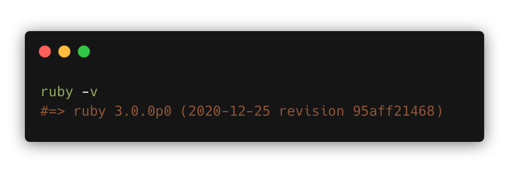

# Setting up TailwindCSS 2.0 with PostCSS 8

We will create a new app running Ruby on Rails 6.1 using Ruby 3.0.0 with TailwindCSS 2.0.
In addition to the above we will setup the additional TailwindCSS plugins for forms, typography and aspect-ratio as well as the Inter var font.
This setup also preps you app for use with TailwindUI.

This has been tested with Rails 6.1.0 running on Ruby 3.0.0.




Create a new Rails app.

```bash
rails new <app_name> -d postgresql
```

Once Bundle and Yarn have run take the steps below.

Change directories into the new project

```bash
cd <app_name>
```

> Note at the time of writing Webpacker and PostCSS 8 are problematic so we will remove that from our app and point to the a known working release of Webpacker

Remove the Webpacker node package

```bash
yarn remove @rails/webpacker
```

Add the following node package

```bash
yarn add rails/webpacker#b6c2180
```

In your **Gemfile**, change the Webpacker gem

```bash
gem 'webpacker', '~> 5.0'
```

to

```bash
gem "webpacker", github: "rails/webpacker", ref: 'b6c2180'
```

Run bundler

```bash
bundle
```

Install TailwindsCSS, PostCSS,  Autopfrefixer and the Tailwind plugins

```bash
yarn add tailwindcss postcss autoprefixer @tailwindcss/forms @tailwindcss/typography @tailwindcss/aspect-ratio
```

Now we need to run the following to create the `application.scss` in `app/javascript/stylesheets`

```bash
mkdir app/javascript/stylesheets && touch app/javascript/stylesheets/application.scss
```

In `app/javascript/stylesheets/application.scss` add the following

```scss
@import "tailwindcss/base";

@import "tailwindcss/components";

@import "tailwindcss/utilities";
```

In `app/javascript/packs/application.js` add the following

```jsx
require("stylesheets/application.scss")
```


In `postcss.config.js` require TailwindCSS

```jsx
require('tailwindcss'),  
```


Then add the `stylesheet_pack_tag` and `Inter font` to `app/views/layouts/application.html.erb`

```ruby
<%= stylesheet_pack_tag 'application', 'data-turbolinks-track': 'reload' %>
```

```ruby
<link rel="stylesheet" href="https://rsms.me/inter/inter.css"
```


Scaffold the TailwindCSS config.

```bash
npx tailwindcss init --full
```

Add the plugins to `tailwind.config.js`

```ruby
require('@tailwindcss/forms'),
require('@tailwindcss/typography'),
require('@tailwindcss/aspect-ratio'),
```


And add the `Inter` font  to `tailwind.config.js`

```ruby
'Inter var',
```


To test it's all working let's generate a page

```bash
rails g controller Home index
```

Add the following to `app/views/home/index.html.erb`

```html
<div class="font-sans bg-white h-screen flex flex-col w-full">
	<div class="h-screen bg-gradient-to-r from-green-400 to-blue-500">
		<div class="px-4 py-48">
			<div class="relative w-full text-center">
				<h1
					class="animate-pulse font-bold text-gray-200 text-2xl mb-6">
				Your TailwindCSS setup is working if this pulses...
				</h1>
			</div>
		</div>
	</div>
</div>
```

Add the root path to point at the above `/home/index` in `config/routes.rb`

```jsx
root 'home#index'
```

Now in your Terminal run

```bash
bin/webpack-dev-server
```

Then in another tab in your Terminal run

```bash
rails db:create db:migrate
```

Then start the Rails server

```bash
rails s
```

Open [`http://localhost:3000`](http://localhost:3000/home/index) in your browser


You should see the above pulsing text effect.